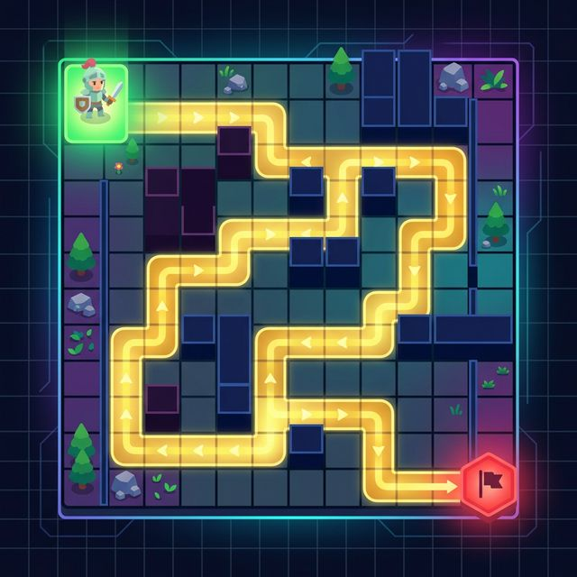
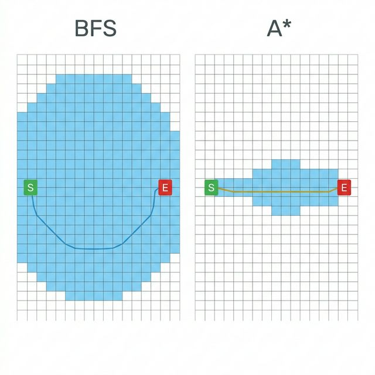
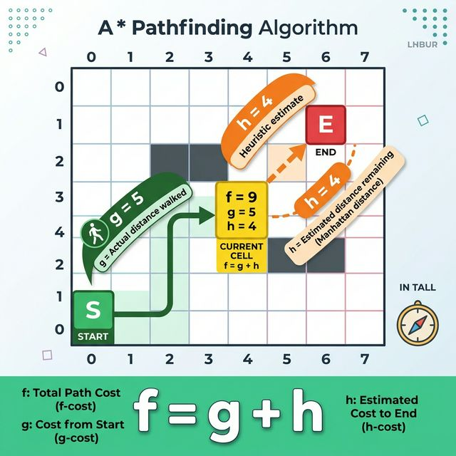
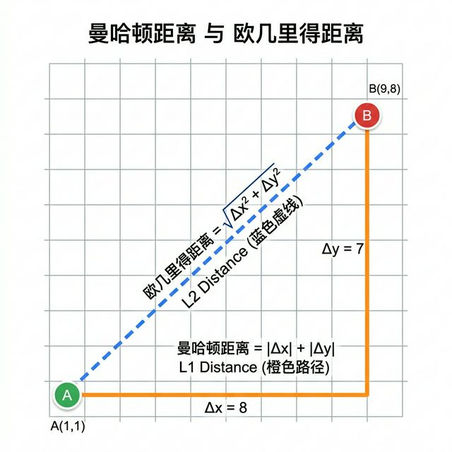
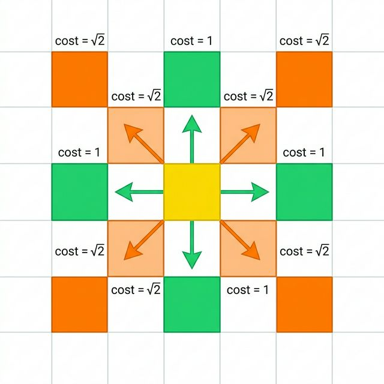
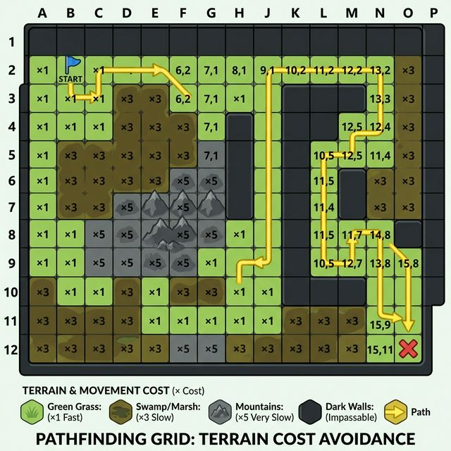
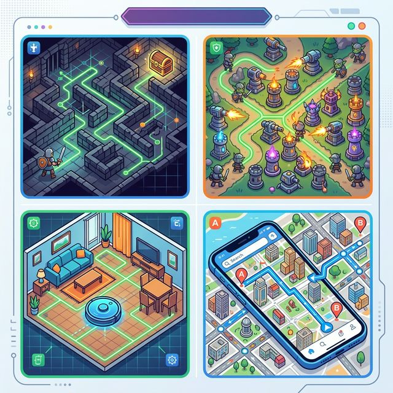

点击上方**码不了一点**+关注和**★ 星标**

# A*寻路——用几行代码让NPC像玩家一样聪明地走迷宫



## 引言

你有没有在《塞尔达传说》里注意过，当你跑到一个犄角旮旯的时候，追着你的怪物居然能绕过障碍物精准找到你？你有没有在《暗黑破坏神》里好奇过，你点一下地图那头，角色为什么能自动绕开所有障碍走过去，丝毫不会一头撞墙？

这不是因为NPC比你聪明——而是因为它们背后有一位"军师"在指路。

这位"军师"的名字叫做 **A\*算法**（读作 A-Star），它是游戏AI领域中**最经典、应用最广泛**的寻路算法，没有之一。从1968年被提出至今，它统治了半个世纪的游戏寻路领域。

今天，我就带大家在 **Cocos Creator** 里从零实现一个完整的 A\*寻路系统，让你的NPC不再"撞了南墙不回头"。

## 涉及知识
- TypeScript
- CocosCreator3.x
- 图论与搜索算法

## 1. 先从一个笨办法说起——BFS 广度优先搜索

在讲 A\* 之前，我们先聊一个最朴素的想法：**像水波一样扩散搜索**。

想象你往一个水池里扔一颗石子，水波会从中心向四面八方均匀扩散。BFS（广度优先搜索）就是这样的思路——从起点出发，一层一层地往外搜索，直到碰到终点。

### 核心逻辑

```typescript
/**
 * 网格节点
 */
class GridNode {
    x: number;
    y: number;
    walkable: boolean = true;
    parent: GridNode | null = null;

    constructor(x: number, y: number) {
        this.x = x;
        this.y = y;
    }
}

/**
 * BFS 搜索
 */
function bfs(grid: GridNode[][], start: GridNode, end: GridNode): GridNode[] {
    const queue: GridNode[] = [start];
    const visited = new Set<GridNode>();
    visited.add(start);

    while (queue.length > 0) {
        const current = queue.shift()!;

        // 找到终点，回溯路径
        if (current === end) {
            return buildPath(current);
        }

        // 获取四方向邻居
        const neighbors = getNeighbors(grid, current);
        for (const neighbor of neighbors) {
            if (!visited.has(neighbor) && neighbor.walkable) {
                visited.add(neighbor);
                neighbor.parent = current;
                queue.push(neighbor);
            }
        }
    }

    return []; // 无路可走
}

/**
 * 获取邻居节点（上下左右）
 */
function getNeighbors(grid: GridNode[][], node: GridNode): GridNode[] {
    const dirs = [[0, 1], [0, -1], [1, 0], [-1, 0]];
    const result: GridNode[] = [];

    for (const [dx, dy] of dirs) {
        const nx = node.x + dx;
        const ny = node.y + dy;
        if (nx >= 0 && nx < grid.length && ny >= 0 && ny < grid[0].length) {
            result.push(grid[nx][ny]);
        }
    }

    return result;
}

/**
 * 回溯构建路径
 */
function buildPath(node: GridNode): GridNode[] {
    const path: GridNode[] = [];
    let current: GridNode | null = node;
    while (current) {
        path.unshift(current);
        current = current.parent;
    }
    return path;
}
```

BFS 能保证找到最短路径，但它的问题是——**太笨了**。

它像无头苍蝇一样四面八方均匀搜索，哪怕终点在你右边一米远的地方，它也会把左边、上边、下边全搜一遍。在大型地图上，这就是灾难性的性能浪费。



## 2. 给搜索装上"导航"——A\*算法

A\* 的核心思想非常优雅：**在 BFS 的基础上，给每个待搜索的节点打一个"分数"，优先搜索分数最低的**。

这个分数就是大名鼎鼎的 **f = g + h** 公式：

- **g**：从起点到当前节点的**实际代价**（走了多远）
- **h**：从当前节点到终点的**预估代价**（还有多远，启发函数）
- **f**：两者之和，代表"经过这个点的路径总代价估计"

> 你可以这样理解：g 代表"已经付出的成本"，h 代表"预期还要付出的成本"，f 就是"总预算"。
> A\*总是选择"总预算最低"的路走——既不贪图眼前的便宜（只看g），也不盲目乐观（只看h）。



### 启发函数h的选择

启发函数的选择对 A\* 的效率至关重要：

```typescript
/**
 * 曼哈顿距离（只允许上下左右移动时使用）
 */
function heuristicManhattan(a: GridNode, b: GridNode): number {
    return Math.abs(a.x - b.x) + Math.abs(a.y - b.y);
}

/**
 * 欧几里得距离（允许任意方向移动时使用）
 */
function heuristicEuclidean(a: GridNode, b: GridNode): number {
    return Math.sqrt((a.x - b.x) ** 2 + (a.y - b.y) ** 2);
}
```

- 只允许四方向（上下左右）移动 → 用**曼哈顿距离**
- 允许八方向或任意方向移动 → 用**欧几里得距离**



### A\*核心代码

```typescript
/**
 * A* 寻路节点
 */
class AStarNode {
    x: number;
    y: number;
    walkable: boolean = true;
    parent: AStarNode | null = null;

    g: number = 0;      // 起点到当前的实际代价
    h: number = 0;      // 当前到终点的预估代价
    f: number = 0;      // 总代价 f = g + h

    constructor(x: number, y: number) {
        this.x = x;
        this.y = y;
    }
}

/**
 * A* 寻路算法
 */
function astar(grid: AStarNode[][], start: AStarNode, end: AStarNode): AStarNode[] {
    const openList: AStarNode[] = [start];   // 待探索
    const closedSet = new Set<AStarNode>();  // 已探索

    start.g = 0;
    start.h = heuristic(start, end);
    start.f = start.g + start.h;

    while (openList.length > 0) {
        // 从 openList 中找 f 最小的节点
        openList.sort((a, b) => a.f - b.f);
        const current = openList.shift()!;

        // 到达终点！
        if (current === end) {
            return buildPath(current);
        }

        closedSet.add(current);

        // 遍历邻居
        const neighbors = getNeighbors(grid, current);
        for (const neighbor of neighbors) {
            if (closedSet.has(neighbor) || !neighbor.walkable) {
                continue;
            }

            const tentativeG = current.g + 1; // 移动一格代价为1

            if (openList.indexOf(neighbor) === -1) {
                // 新发现的节点
                openList.push(neighbor);
            } else if (tentativeG >= neighbor.g) {
                // 这条路不比之前的好
                continue;
            }

            // 更新最优路径
            neighbor.parent = current;
            neighbor.g = tentativeG;
            neighbor.h = heuristic(neighbor, end);
            neighbor.f = neighbor.g + neighbor.h;
        }
    }

    return []; // 无路可达
}

/**
 * 启发函数（曼哈顿距离）
 */
function heuristic(a: AStarNode, b: AStarNode): number {
    return Math.abs(a.x - b.x) + Math.abs(a.y - b.y);
}
```

简单几行代码，我们就实现了一个能"聪明走路"的算法。

## 3. 在Cocos Creator中实战——可视化A\*寻路

光看代码太抽象，我们来在Cocos Creator里搞个可视化的demo，让你**亲眼看到**A\*是怎么一步步找到路的。

搭建一个场景，我们需要以下几样东西：

- `Graphics`组件，用于绘制网格和路径
- 一个按钮用于开始寻路
- 一个按钮用于重置地图

新建脚本`AStarDemo.ts`并挂载到Canvas节点上

### 地图与可视化

```typescript
import {
    _decorator, Component, Graphics, Color, UITransform,
    EventTouch, input, Input, v3, Button, Node
} from 'cc';

const { ccclass, property } = _decorator;

// 格子状态
enum CellState {
    EMPTY = 0,    // 空地
    WALL = 1,     // 墙壁
    START = 2,    // 起点
    END = 3,      // 终点
    PATH = 4,     // 路径
    VISITED = 5,  // 已访问
    OPEN = 6,     // 待探索
}

// 颜色配置
const COLORS: Record<CellState, Color> = {
    [CellState.EMPTY]: new Color(240, 240, 240),        // 浅灰
    [CellState.WALL]: new Color(50, 50, 50),             // 深灰
    [CellState.START]: new Color(76, 175, 80),           // 绿色
    [CellState.END]: new Color(244, 67, 54),             // 红色
    [CellState.PATH]: new Color(255, 193, 7),            // 金色
    [CellState.VISITED]: new Color(144, 202, 249),       // 浅蓝
    [CellState.OPEN]: new Color(129, 212, 250),          // 天蓝
};

@ccclass('AStarDemo')
export class AStarDemo extends Component {

    @property(Graphics)
    graphics: Graphics = null;

    @property(Node)
    startBtn: Node = null;

    @property(Node)
    resetBtn: Node = null;

    // 网格配置
    private readonly COLS = 20;
    private readonly ROWS = 15;
    private readonly CELL_SIZE = 30;
    private readonly GAP = 2;

    private grid: CellState[][] = [];
    private startPos = { x: 1, y: 1 };
    private endPos = { x: 18, y: 13 };

    private isDrawingWall = false;

    start() {
        this.initGrid();
        this.drawGrid();

        input.on(Input.EventType.TOUCH_START, this.onTouchStart, this);
        input.on(Input.EventType.TOUCH_MOVE, this.onTouchMove, this);
        input.on(Input.EventType.TOUCH_END, this.onTouchEnd, this);

        this.startBtn.on(Button.EventType.CLICK, this.onStartClick, this);
        this.resetBtn.on(Button.EventType.CLICK, this.onResetClick, this);
    }

    /**
     * 初始化网格
     */
    initGrid() {
        this.grid = [];
        for (let x = 0; x < this.COLS; x++) {
            this.grid[x] = [];
            for (let y = 0; y < this.ROWS; y++) {
                this.grid[x][y] = CellState.EMPTY;
            }
        }
        this.grid[this.startPos.x][this.startPos.y] = CellState.START;
        this.grid[this.endPos.x][this.endPos.y] = CellState.END;
    }

    /**
     * 触摸画墙壁
     */
    onTouchStart(e: EventTouch) {
        this.isDrawingWall = true;
        this.toggleWall(e);
    }

    onTouchMove(e: EventTouch) {
        if (this.isDrawingWall) this.toggleWall(e);
    }

    onTouchEnd() {
        this.isDrawingWall = false;
    }

    toggleWall(e: EventTouch) {
        const pos = e.getUILocation();
        const localPos = this.getComponent(UITransform)
            .convertToNodeSpaceAR(v3(pos.x, pos.y, 0));

        const cellX = Math.floor(
            (localPos.x + (this.COLS * (this.CELL_SIZE + this.GAP)) / 2)
            / (this.CELL_SIZE + this.GAP)
        );
        const cellY = Math.floor(
            (localPos.y + (this.ROWS * (this.CELL_SIZE + this.GAP)) / 2)
            / (this.CELL_SIZE + this.GAP)
        );

        if (cellX < 0 || cellX >= this.COLS || cellY < 0 || cellY >= this.ROWS) return;

        const state = this.grid[cellX][cellY];
        if (state === CellState.START || state === CellState.END) return;

        this.grid[cellX][cellY] =
            state === CellState.WALL ? CellState.EMPTY : CellState.WALL;

        this.drawGrid();
    }

    /**
     * 绘制网格
     */
    drawGrid() {
        this.graphics.clear();
        const offsetX = -(this.COLS * (this.CELL_SIZE + this.GAP)) / 2;
        const offsetY = -(this.ROWS * (this.CELL_SIZE + this.GAP)) / 2;

        for (let x = 0; x < this.COLS; x++) {
            for (let y = 0; y < this.ROWS; y++) {
                const px = offsetX + x * (this.CELL_SIZE + this.GAP);
                const py = offsetY + y * (this.CELL_SIZE + this.GAP);

                const color = COLORS[this.grid[x][y]];
                this.graphics.fillColor = color;
                this.graphics.rect(px, py, this.CELL_SIZE, this.CELL_SIZE);
                this.graphics.fill();
            }
        }
    }

    /**
     * 点击"开始寻路"
     */
    onStartClick() {
        this.runAStar();
    }

    /**
     * 点击"重置"
     */
    onResetClick() {
        this.initGrid();
        this.drawGrid();
    }

    /**
     * 执行A*寻路并可视化
     */
    runAStar() {
        // 清除上次的路径和访问标记
        for (let x = 0; x < this.COLS; x++) {
            for (let y = 0; y < this.ROWS; y++) {
                const s = this.grid[x][y];
                if (s === CellState.PATH || s === CellState.VISITED || s === CellState.OPEN) {
                    this.grid[x][y] = CellState.EMPTY;
                }
            }
        }

        // 构建寻路节点
        interface PathNode {
            x: number;
            y: number;
            g: number;
            h: number;
            f: number;
            parent: PathNode | null;
        }

        const nodes: PathNode[][] = [];
        for (let x = 0; x < this.COLS; x++) {
            nodes[x] = [];
            for (let y = 0; y < this.ROWS; y++) {
                nodes[x][y] = { x, y, g: 0, h: 0, f: 0, parent: null };
            }
        }

        const start = nodes[this.startPos.x][this.startPos.y];
        const end = nodes[this.endPos.x][this.endPos.y];

        const openList: PathNode[] = [start];
        const closedSet = new Set<PathNode>();

        start.h = Math.abs(start.x - end.x) + Math.abs(start.y - end.y);
        start.f = start.h;

        const visitedOrder: PathNode[] = [];  // 记录访问顺序

        let found = false;
        while (openList.length > 0) {
            openList.sort((a, b) => a.f - b.f);
            const current = openList.shift()!;

            if (current === end) {
                found = true;
                break;
            }

            closedSet.add(current);
            visitedOrder.push(current);

            const dirs = [[0, 1], [0, -1], [1, 0], [-1, 0]];
            for (const [dx, dy] of dirs) {
                const nx = current.x + dx;
                const ny = current.y + dy;

                if (nx < 0 || nx >= this.COLS || ny < 0 || ny >= this.ROWS) continue;
                if (this.grid[nx][ny] === CellState.WALL) continue;

                const neighbor = nodes[nx][ny];
                if (closedSet.has(neighbor)) continue;

                const newG = current.g + 1;

                if (openList.indexOf(neighbor) === -1) {
                    openList.push(neighbor);
                } else if (newG >= neighbor.g) {
                    continue;
                }

                neighbor.parent = current;
                neighbor.g = newG;
                neighbor.h = Math.abs(nx - end.x) + Math.abs(ny - end.y);
                neighbor.f = neighbor.g + neighbor.h;
            }
        }

        // 可视化：标记已访问节点
        for (const node of visitedOrder) {
            if (this.grid[node.x][node.y] === CellState.EMPTY) {
                this.grid[node.x][node.y] = CellState.VISITED;
            }
        }

        // 可视化：标记路径
        if (found) {
            let pathNode: PathNode | null = end;
            while (pathNode) {
                if (this.grid[pathNode.x][pathNode.y] === CellState.EMPTY ||
                    this.grid[pathNode.x][pathNode.y] === CellState.VISITED) {
                    this.grid[pathNode.x][pathNode.y] = CellState.PATH;
                }
                pathNode = pathNode.parent;
            }
        }

        this.drawGrid();
    }
}
```

运行后你会看到：
- **浅蓝色**区域是A\*搜索过的区域——注意它**不是均匀扩散**的，而是朝终点方向集中搜索
- **金色**路线就是最终找到的最短路径
- 你可以用手指/鼠标画墙壁，然后点"开始寻路"看A\*如何绕过障碍

对比前面的BFS，A\*搜索的区域明显**更小更聚焦**，这就是启发函数的威力所在。

## 4. BFS vs A\* 直观对比

| 维度 | BFS（广度优先） | A\*（启发式搜索） |
|------|---------------|-----------------|
| 搜索方式 | 像水波一样均匀扩散 | 像导航一样定向搜索 |
| 搜索效率 | 搜索大量无用节点 | 集中搜索目标方向 |
| 找到最短路径？ | ✅ 保证 | ✅ 保证（启发函数满足条件时） |
| 性能 | 大地图下性能差 | 大地图优势明显 |
| 适用场景 | 小地图、无权图 | 大型游戏地图、导航系统 |

## 5. 进阶：支持8方向移动



现实的游戏中，角色不仅能上下左右走，还能走对角线。修改很简单：

```typescript
/**
 * 8方向的邻居和代价
 */
const DIRS_8 = [
    { dx: 0, dy: 1, cost: 1 },      // 上
    { dx: 0, dy: -1, cost: 1 },     // 下
    { dx: 1, dy: 0, cost: 1 },      // 右
    { dx: -1, dy: 0, cost: 1 },     // 左
    { dx: 1, dy: 1, cost: 1.414 },  // 右上（√2）
    { dx: 1, dy: -1, cost: 1.414 }, // 右下
    { dx: -1, dy: 1, cost: 1.414 }, // 左上
    { dx: -1, dy: -1, cost: 1.414 },// 左下
];

// 将邻居遍历改为：
for (const { dx, dy, cost } of DIRS_8) {
    const nx = current.x + dx;
    const ny = current.y + dy;

    // ... 省略边界和墙壁检查 ...

    const newG = current.g + cost;  // 对角线代价为 √2

    // ... 后续逻辑不变 ...
}
```

对角线的移动代价是 √2 ≈ 1.414，而不是1，因为对角线方向实际距离就是更远的。

同时，启发函数也要换成**欧几里得距离**或**切比雪夫距离**：

```typescript
/**
 * 切比雪夫距离（8方向移动推荐）
 */
function heuristicChebyshev(a: PathNode, b: PathNode): number {
    const dx = Math.abs(a.x - b.x);
    const dy = Math.abs(a.y - b.y);
    return Math.max(dx, dy) + (Math.SQRT2 - 1) * Math.min(dx, dy);
}
```

## 6. 进阶：地形权重



在真实游戏中，不同地形的移动代价不同——走平地快、走沼泽慢、走山路更慢。

```typescript
// 地形代价表
const TERRAIN_COST: Record<number, number> = {
    0: 1,    // 平地
    1: 999,  // 墙壁（不可通行）
    2: 3,    // 沼泽
    3: 5,    // 山路
};

// 计算移动代价时使用地形权重
const terrainCost = TERRAIN_COST[this.grid[nx][ny]] || 1;
const newG = current.g + baseCost * terrainCost;
```

这样NPC就不会傻乎乎地穿过沼泽了，它会像真正的玩家一样——宁可绕路也要走大路。

## 7. 应用场景

A\*不仅仅用在游戏里，它的应用远比你想象的广泛：

- **游戏NPC寻路**：《塞尔达》、《暗黑破坏神》、《星际争霸》等
- **塔防游戏**：敌人沿最优路径进攻，建塔改变路径
- **地图导航**：高德、百度地图的路线规划核心思路
- **机器人路径规划**：扫地机器人就是靠类似算法工作的
- **物流配送**：快递路线优化



## 相关代码在哪里

> https://github.com/haiyoucuv/Wechat_article

## 结语

A\*算法虽然已经50多岁了，但它的设计思想依然优雅——用一个简单的 `f = g + h` 公式，就让盲目搜索变成了有方向的智能导航。从BFS的"无脑扩散"到A\*的"精准制导"，几行代码的差距就是"笨"和"聪明"的距离。

下次你在游戏里被怪物精准追杀的时候，别骂AI太强——它可能只是用了几行 A\* 代码而已。

点击上方**码不了一点**+关注和**★ 星标**
