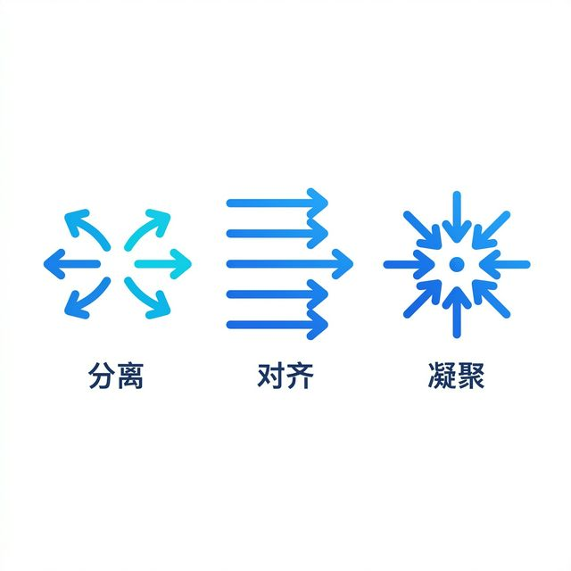
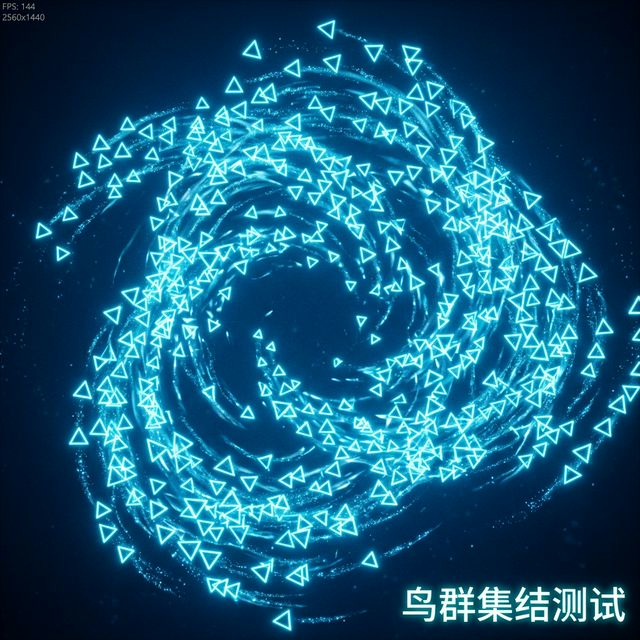

点击上方**码不了一点**+关注和**★ 星标**


## 引言

你是否曾在《瘟疫传说》中被如潮水般涌来的鼠海震撼？或者在《对马岛之魂》里停下脚步，仰望天空中盘旋的飞鸟？又或者在《流放者柯南》中面对成百上千的丧尸潮感到局促不安？

这些游戏中的庞大群体往往由成百上千个独立单位组成。如果开发者给每一只动物、每一只飞鸟都费心手写移动轨迹，恐怕写到地老天荒也写不完；要是让它们都用寻路算法（比如 A*）追踪同一个目标，它们又会笨拙地挤成一团甚至重叠在一起，毫无真实的生命感可言。

那么，怎样才能让大量的独立 NPC 表现出宛如真实生命体般的**集体智慧**，并且丝毫不觉得死板呢？

答案就是诞生于 1986 年、至今仍在广泛应用且被无数大作采用的**集群行为（Flocking）算法 —— Boids**。

今天，咱们就来揭秘这个“群体智慧之源”。带你在 **Cocos Creator** 里用极简的代码手撸一套飞鸟/鱼群系统，让你游戏里的怪物、动物瞬间“活”过来！

## 涉及知识
- TypeScript
- CocosCreator 3.x
- 向量数学运算
- Boids (集群) 算法

## 1. 什么是 Boids 算法？

1986 年，计算机图形学专家 Craig Reynolds 在仔细观察了真实的鸟群和鱼群后，发现了一个惊人的秘密：**在庞大的群体中其实并没有一个“发号施令的总指挥”，宏观上极为复杂的群体运动，仅仅是成百上千个个体在遵循几条极简的底层规则而“涌现”出来的。**

由此他提炼出了堪称集群动画里黄金法则的三条定律：

1. **分离 (Separation)**：**社恐发作**。如果发现有同伴离得太近了，赶紧闪开，以免撞车。
2. **对齐 (Alignment)**：**从众心理**。看看周围的同伴往哪个方向飞、飞得多快，自己也赶紧把速度和方向调整成跟大家一样。
3. **凝聚 (Cohesion)**：**抱团取暖**。落单容易被猎食者吃掉，所以要尽量朝着视野内伙伴们的中心区域靠拢。



只要给每个个体（我们称之为 Boid）施加这三个简单的作用力，不可思议的奇迹就会在屏幕上发生。

## 2. 三大法则的代码实现

在数学的视界中，“速度”、“位置”和“力”都可以用**向量（Vector）**来完美表示。让我们一步步用代码实现这三种神奇的力。

### 2.1 准备工作：单个 Boid 的基础结构

既然要模拟群体，首先要定义好单个个体（也就是一只鸟）的数据结构。它需要有位置、速度、加速度（受力），以及最大飞行限制。

```typescript
import { Vec2, v2 } from 'cc';

export class Boid {
    // ---------------- 核心物理属性 ----------------
    // 当前鸟所在的(x, y)二维坐标位置
    position: Vec2 = v2(0, 0);       
    // 当前的飞行速度和方向，初始给一个随机的朝向和速度向量
    velocity: Vec2 = v2((Math.random() - 0.5) * 240, (Math.random() - 0.5) * 240);       
    // 加速度（在每一帧中，它实际上代表本帧内该鸟受到的所有力的合力）
    acceleration: Vec2 = v2(0, 0);   

    // ---------------- 极限参数限制 ----------------
    // 极限飞行速度（鸟不能无限制加速，有个最高时速）
    maxSpeed: number = 240;          
    // 转身有多灵活（力越大，转向越快，这决定了鸟群飞行的“平滑度”）
    maxForce: number = 9;            
    
    /**
     * 辅助函数：限制向量的最大长度
     * 用于确保速度不超速，转向力不太突兀
     */
    private limitVector(vec: Vec2, max: number) {
        if (vec.lengthSqr() > max * max) {
            vec.normalize().multiplyScalar(max);
        }
    }

    /**
     * 每帧调用，通过加速度更新速度，通过速度更新位置
     * @param dt 距离上一帧的时间间隔（Delta Time）
     */
    update(dt: number) {
        // 物理公式：速度 = 初始速度 + 加速度 * 时间 (v = v0 + a * t)
        const acc = this.acceleration.clone();
        acc.multiplyScalar(dt * 60);
        this.velocity.add(acc);
        // 限制不要超过最高飞行速度
        this.limitVector(this.velocity, this.maxSpeed);
        
        // 物理公式：位移 = 初始位移 + 速度 * 时间 (s = s0 + v * t)
        const vel = this.velocity.clone().multiplyScalar(dt);
        this.position.add(vel);
        
        // 重要：每计算完一帧的位移，重置加速度（合力归零），准备迎接下一帧的受力判断
        this.acceleration.set(0, 0);
    }
}
```

> **[截图占位：此处可以放一张单个小鸟在一个空旷场景中遵循基础物理匀速运动的简单 Gif 图，或者是标注了速度与受力向量方向的图解示意图]**

*(注：`limitVector` 函数是一个简单的数学辅助，用于将向量的长度限制在 `maxForce` 范围内，保证转向平滑。)*

### 2.2 绝招一：分离 (Separation) —— 保持社交距离

**逻辑**：检查所有在“排斥视野半径”内的同伴，计算一个远离它们的反向向量。越靠近你的同伴，对你产生的排斥力就越大。

```typescript
    /**
     * 计算分离力 (Separation)
     * @param boids 整个鸟群数组
     * @param perception 鸟的感知视野半径
     */
    separation(boids: Boid[], perception: number): Vec2 {
        const steering = v2(0, 0); // 最终我们要返回的转向力
        let total = 0; // 记录有多少个同伴进入了过于亲密的排斥区域
        
        for (const other of boids) {
            if (other === this) continue; // 不和自己比较
            
            // 计算两只鸟之间的真实距离
            const dist = Vec2.distance(this.position, other.position);
            
            // 规则1：如果距离小于 perception * 0.5（把防撞安全距离设为总视野的一半）
            if (dist > 0 && dist < perception * 0.5) {
                // 计算从同伴指向自己的向量（即远离同伴的方向）
                const diff = this.position.clone().subtract(other.position);
                // 距离越近，排斥力越大（与距离的平方成反比）
                diff.multiplyScalar(1 / (dist * dist)); 
                steering.add(diff);
                total++;
            }
        }
        
        // 如果有需要躲避的同伴，求平均受力
        if (total > 0) {
            steering.multiplyScalar(1 / total);
            // 按照最大速度全速逃离
            steering.normalize().multiplyScalar(this.maxSpeed);
            // Craig Reynolds 转向公式：转向力 = 期望速度 - 当前速度
            steering.subtract(this.velocity);
            // 限制转向灵敏度，让转向显得平滑自然，而不是瞬间回头
            this.limitVector(steering, this.maxForce);
        }
        return steering;
    }
```

> **[动图占位：此处放一张只开启“分离”权重，其它力为 0 的运行 Gif，展示鸟群在靠近时会像磁铁同极一样互相急促弹开的现象]**


### 2.3 绝招二：对齐 (Alignment) —— 保持步调一致

**逻辑**：算出周围视野范围内同伴的“平均飞行方向和速度”，然后努力把自己的飞行速度调整到和大家一致。

```typescript
    /**
     * 计算对齐力 (Alignment)
     */
    alignment(boids: Boid[], perception: number): Vec2 {
        const steering = v2(0, 0);
        let total = 0;
        
        for (const other of boids) {
            if (other === this) continue;

            const dist = Vec2.distance(this.position, other.position);
            // 如果同伴在自己的广角视野之内
            if (dist > 0 && dist < perception) {
                // 观察同伴的飞行速度(包含了方向)，并累加起来
                steering.add(other.velocity);
                total++;
            }
        }
        
        // 如果视野内有同伴，计算它们的平均飞行速度
        if (total > 0) {
            steering.multiplyScalar(1 / total);
            // 设定期望速度：我们要以最大速度向该平均方向飞行
            steering.normalize().multiplyScalar(this.maxSpeed);
            // 转向力 = 期望速度 - 当前速度
            steering.subtract(this.velocity);
            this.limitVector(steering, this.maxForce);
        }
        return steering;
    }
```

> **[动图占位：此处放一张只开启“对齐”权重的 Gif，展示原本散乱飞舞的小鸟，慢慢汇聚成朝着同一个方向飞行的雁阵]**


### 2.4 绝招三：凝聚 (Cohesion) —— 寻找组织的中心

**逻辑**：算出周围所有同伴的中心点坐标（即求各个同伴位置的平均值），朝着那个组织的中心区域飞去。落单可是很危险的！

```typescript
    /**
     * 计算凝聚力 (Cohesion)
     */
    cohesion(boids: Boid[], perception: number): Vec2 {
        const steering = v2(0, 0);
        let total = 0;
        
        for (const other of boids) {
            if (other === this) continue;

            const dist = Vec2.distance(this.position, other.position);
            // 只要在视野之内，都是我们的好兄弟
            if (dist > 0 && dist < perception) {
                // 记录它们的位置
                steering.add(other.position);
                total++;
            }
        }
        
        if (total > 0) {
            // 求出视野内所有同伴的“质心”（平均坐标位置）
            steering.multiplyScalar(1 / total);
            // 向着那个中心点移动（这里的 seek 方法我们在下面提供）
            return this.seek(steering);
        }
        return v2(0, 0);
    }

    /**
     * 辅助力：靠近某个目标点 (Seek)
     */
    seek(target: Vec2): Vec2 {
        // 期望的前进向量 = 目标点 - 当前点
        const desired = target.clone().subtract(this.position);
        desired.normalize().multiplyScalar(this.maxSpeed);
        // 转向力 = 期望速度 - 当前速度
        const steering = desired.subtract(this.velocity);
        this.limitVector(steering, this.maxForce);
        return steering;
    }
```

> **[动图占位：此处放一张只开启“凝聚”权重的 Gif，展示四面八方的小鸟像收到集结号一样收缩聚合成一个密集的活动圆团]**


### 2.5 聚合组装：力的交响乐

有了三种独立的力，最后一步就像勾兑鸡尾酒一样，给每种力加上一个**权重比例（Weight）**，然后统统叠加到这只鸟本帧的加速度（合力）上！

```typescript
    /**
     * 最终聚合计算入口
     * 将分离、对齐、凝聚三种力按照权重相加
     */
    flock(boids: Boid[], params: any) {
        // 分别计算三种力，并乘上我们在面板上配置的权重比
        const sep = this.separation(boids, params.perception).multiplyScalar(params.sepWeight);
        const ali = this.alignment(boids, params.perception).multiplyScalar(params.aliWeight);
        const coh = this.cohesion(boids, params.perception).multiplyScalar(params.cohWeight);

        // 终极法则：万物理论之【向量叠加】！
        // 把所有的力都施加在自己身上，更新本帧这只鸟的加速度合力
        this.acceleration.add(sep);
        this.acceleration.add(ali);
        this.acceleration.add(coh);
    }
```


## 3. 在 Cocos Creator 中将它们逐步融合！

算法核心写好了，接下来我们要回到具体游戏引擎的具体视界中。按照我们一贯的硬核科普风格，太长的大段逻辑代码容易犯困，因此我们拆解实现：

### 3.1 搭建群组管理器基础框架与属性

我们需要一个全局的管理器组件挂载在场景的空节点上，并定义一些我们需要暴露在属性检查器（Inspector）里的数值开关：鸟的生成数量、独立权重的比例大小，和这群鸟的感知半径。

```typescript
import { _decorator, Component, Node, instantiate, Prefab, Vec3, view, Input, input, EventMouse, v2, UITransform, MotionStreak } from 'cc';
import { Boid } from './Boid';
const { ccclass, property } = _decorator;

@ccclass('FlockManager')
export class FlockManager extends Component {
    // 指向我们的鸟儿源预制体
    @property(Prefab) boidPrefab: Prefab | null = null;
    // 生成多少只小鸟？
    @property boidCount: number = 100;

    // ---------------- 行为调节参数 ----------------
    // 默认分离权重给高一点，避免大家都全挤在一个中心点穿模
    @property sepWeight: number = 1.5;
    @property aliWeight: number = 1.0;
    @property cohWeight: number = 1.0;
    // 鸟的社交视野半径范围
    @property perception: number = 50; 

    // 后台维护的数据集与节点集
    private boidsData: Boid[] = [];
    private boidNodes: Node[] = [];
    
    // 记录屏幕的高宽边界，用于跑出屏幕后进行传送处理
    private screenWidth: number = 0;
    private screenHeight: number = 0;
    private uiTransform: UITransform | null = null;
}
```

> **[截图占位：此处需要放一张 Cocos Creator 编辑器截图：展示 FlockManager 挂载在场景某节点上，并在 Inspector 大纲视图中暴露出这些可直接填写的调节参数属性的面貌]**

### 3.2 初始化鸟群大军：满城尽带“飞羽”

紧接着，我们在 `start` 生命周期内，根据设定的 `boidCount` 数量实例化这些个数字生命。这里尤其要注意如何同步这些无形的数据 `boidsData` 和 有形的渲染节点 `boidNodes`。

```typescript
    start() {
        // 1. 获取屏幕视图的高宽尺寸，方便限定鸟活动的“边界”
        const visibleSize = view.getVisibleSize();
        this.screenWidth = visibleSize.width;
        this.screenHeight = visibleSize.height;

        this.uiTransform = this.node.getComponent(UITransform);
        if(!this.uiTransform) {
            this.uiTransform = this.node.addComponent(UITransform);
        }
        this.uiTransform.setContentSize(this.screenWidth, this.screenHeight);

        // 2. 循环初始化节点实体和其对应的物理数字载体
        for (let i = 0; i < this.boidCount; i++) {
            if (!this.boidPrefab) break;

            const node = instantiate(this.boidPrefab); // 生成真正的渲染外观节点
            const boid = new Boid();                   // 生成它背后的集群物理结算器
            
            // 把它随机扔在屏幕范围内的任意一个地方
            boid.position.set(
                (Math.random() - 0.5) * this.screenWidth, 
                (Math.random() - 0.5) * this.screenHeight
            );
            this.boidsData.push(boid); // 把灵魂装填进列表
            
            // 同步这第一帧的初始状态给节点
            node.setPosition(boid.position.x, boid.position.y);
            // 把随机生成的速度向量转成 2D 欧拉角，这句会让每个鸟的鸟嘴（尖叫部位）都对齐飞行的方向
            const angle = Math.atan2(boid.velocity.y, boid.velocity.x);
            node.setRotationFromEuler(new Vec3(0, 0, angle * 180 / Math.PI - 90));

            this.node.addChild(node);
            this.boidNodes.push(node); // 把肉体挂载管理起来
            
            // （处理引擎特性的边界代码：因为上面发生过原点到随机坐标的顺移跳变，需要清除首帧的尾迹线残留）
            const streak = node.getComponent(MotionStreak) || node.getComponentInChildren(MotionStreak);
            if (streak) {
                streak.reset();
                this.scheduleOnce(() => {
                    if (streak && streak.isValid) streak.reset();
                }, 0);
            }
        }
    }
```

> **[截图占位：此处建议放一张此时由于还未挂载主更新，游戏运行后屏幕上满是由于随机坐标导致随意凌乱散落且静止不动的各色小三角形/小鸟图案的静态截图]**

### 3.3 核心循环：让鸟群“活”过来并解决出屏穿越问题

为了让刚才生成的代码真正具备智慧，每帧引擎重绘前（`update`）我们都需要调用我们牛逼的 集群物理结算大脑： `flock`！
除此之外，在自然界中，飞出你视野的鸟只是游荡他处，但在此处由于是个单屏环境，为了视觉效果我们像《吃豆人》游戏里的地图边界魔法一样，让飞出屏幕右边缘的小鸟马上从屏幕左侧边缘钻出来填补。

```typescript
    update(dt: number) {
        // 实时打包右侧面板上的权重配置
        const params = {
            sepWeight: this.sepWeight,
            aliWeight: this.aliWeight,
            cohWeight: this.cohWeight,
            perception: this.perception
        };

        // 步骤一：遍历所有鸟，执行互相之间的 Boids 物理分析，累积更新新的底层受力加速度
        for (const boid of this.boidsData) {
            boid.flock(this.boidsData, params);
        }

        // 步骤二：统一将所有结算出来的数据表现应用到位移矩阵，并赋给外层的渲染节点
        for (let i = 0; i < this.boidsData.length; i++) {
            const boid = this.boidsData[i];
            
            // 调用单体 Boid 的更新步骤 (本质通过牛顿定律应用受力转换到速度和位移变更上)
            boid.update(dt);
            
            // 越界传送检查魔法：飞出屏幕视野边缘就从另一头传送折返
            const didWrap = this.wrapAround(boid); 

            // 将背后的最终物理位移赋予回场景节点控制，完成同步
            const node = this.boidNodes[i];
            node.setPosition(boid.position.x, boid.position.y);
            
            // 随时跟踪转向角，改变渲染图片旋转朝向
            const angle = Math.atan2(boid.velocity.y, boid.velocity.x);
            node.setRotationFromEuler(new Vec3(0, 0, angle * 180 / Math.PI - 90));
            
            // 依然是引擎特性处理：如果触发了吃豆人跨屏强制传送，切断由于两点位移差引发渲染的尾迹图断横穿拉丝
            if (didWrap) {
                const streak = node.getComponent(MotionStreak) || node.getComponentInChildren(MotionStreak);
                if (streak) {
                    streak.reset();
                    // 用 scheduleOnce 延迟一帧，确保引擎渲染后完美断开拉长线 BUG
                    this.scheduleOnce(() => {
                        if (streak && streak.isValid) streak.reset();
                    }, 0);
                }
            }
        }
    }

    /**
     * 判断并处理鸟类飞出屏幕边界“从另一头环绕折返”的方法实现
     */
    private wrapAround(boid: Boid): boolean {
        // 增加 50 像素的防露馅缓冲区，让鸟彻底在视野盲区才传送，视觉上不突兀
        const margin = 50; 
        const halfW = this.screenWidth / 2 + margin;
        const halfH = this.screenHeight / 2 + margin;
        let wrapped = false;
        
        // 分别作左右、上下的极值越界检验
        if (boid.position.x > halfW) { boid.position.x = -halfW; wrapped = true; }
        else if (boid.position.x < -halfW) { boid.position.x = halfW; wrapped = true; }

        if (boid.position.y > halfH) { boid.position.y = -halfH; wrapped = true; }
        else if (boid.position.y < -halfH) { boid.position.y = halfH; wrapped = true; }
        
        return wrapped;
    }
```

加上这些组装好的大结构调度代码，此时你再去点击项目预览跑一下，看看眼前那让人大受震撼的前所未有运行效果：



> **[动图占位：强烈建议文章原有的这幅 flocking_demo.png 在此处更换成一段循环的 Gif 动图，展示原本散乱的这几百只鸟此时聚集成数个群体在天空中自然流动避让、丝滑地结伴盘旋飞舞的完整演示]**

无需去费劲写复杂的场景导航寻道网格生成，也没有高人一等的死算法中控调配，这 100 只小鸟就已经自动形成了涌现出的智能形态。


## 4. 进阶玩法：加入天敌与鼠标跟随的“神迹介入”

如果光是在荧幕做看客，看着它们自动地在循环内流转飞翔终究还是让人感觉发痒。我们完全可以结合底层引擎的输入事件，人为地降下一股“强交互干预力”：

- **逃避捕食者 (Flee)**：充当神龛上的灾难黑手，玩家一键右击，向人群播散恐慌从而引起向外退却的逃离力。
- **目标吸引 (Arrive/Seek)**：充当喂鸟者的火种，玩家一键左击，引诱整个群体向你的鼠标中心靠近。

首先我们在之前的 `Boid.ts` 追加一个**受到惊吓急剧回退**的具体物理实现：

```typescript
    /**
     * Boid 内部新增的物理反应：躲避天敌！(Flee)
     */
    flee(target: Vec2, radius: number): Vec2 {
        const d = Vec2.distance(this.position, target);
        // 判断：只有当天敌逼近，进入了自己的保命防线感知半径时才发生强制逃离
        if (d < radius) {
            // 逃命期望前进方向 = 自己当前的位置 - 灾变目标位置 (计算出一个强推向远处的排斥向量)
            const desired = this.position.clone().subtract(target);
            // 逃命时肾上腺素飙升激发机能潜力，我们以 2 倍极限速度逃逸
            desired.normalize().multiplyScalar(this.maxSpeed * 2);
            const steering = desired.subtract(this.velocity);
            
            // 逃命时的转身甩尾必须比平常普通飞行灵敏得多，赋予 3 倍的强制转向力矩限制上限
            this.limitVector(steering, this.maxForce * 3);
            return steering;
        }
        return v2(0, 0);
    }
```

紧接着修改主场控 `FlockManager.ts` 类：我们要拦截捕捉底层的各种鼠标输入信号源。

```typescript
    // ... FlockManager.ts 类顶部新增额外鼠标事件标记属性 ...
    private mouseActive: boolean = false;
    private mouseAttract: boolean = false;
    private mousePosInput = v2(0, 0);

    // 你需要回到 start() 方法末尾中，去插入对全局的事件监听注册:
    // ...
    //   input.on(Input.EventType.MOUSE_DOWN, this.onMouseDown, this);
    //   input.on(Input.EventType.MOUSE_UP, this.onMouseUp, this);
    //   input.on(Input.EventType.MOUSE_MOVE, this.onMouseMove, this);
    // ...

    onMouseDown(e: EventMouse) {
        this.mouseActive = true;
        // 人为规则定义：如果按下鼠标右键(getButton===2)，它就是一枚核弹引发了恐吓反应，而左键则产生迷人的引力
        this.mouseAttract = e.getButton() === 2; 
        this.updateMousePos(e);
    }

    onMouseUp(e: EventMouse) {
        this.mouseActive = false; // 抬起按键一切归于平静
    }

    onMouseMove(e: EventMouse) {
        this.updateMousePos(e);  // 鼠标移动的时候我们同样实时跟进交互坐标变换
    }

    updateMousePos(e: EventMouse) {
        // 由于触控的原生的纯屏幕坐标原点不在我们编辑场景的中心，
        // 我们利用挂载的 uiTransform 做一套向当前节点局部中心系坐标的标准转换。
        const pos = e.getUILocation();
        const localPos = this.uiTransform!.convertToNodeSpaceAR(new Vec3(pos.x, pos.y, 0));
        this.mousePosInput.set(localPos.x, localPos.y);
    }
```

只差最后的临门一脚了！我们再次改写本节刚才讲到的核心 `update` 遍历，将我们由玩家之手赋予的外来强干预期接入物理引擎：

```typescript
        // ... (原先在 update 中第一步遍历受力的部分)
        for (const boid of this.boidsData) {
            boid.flock(this.boidsData, params);

            // 重点：这里加上了判断，如果检测到当前的交互信号灯已被玩家点亮
            if (this.mouseActive) {
                if (this.mouseAttract) {
                    // 如果正在实施吸引模式：产生一个求着它们飞扑向目标的合力，我们这里使用两倍强度(x2)压过基础法则
                    const attract = boid.seek(this.mousePosInput).multiplyScalar(2);
                    boid.acceleration.add(attract);
                } else {
                    // 如果正在实施恐吓模式：只要在此刻那 300 的灾变惊吓范围内，立刻让我往四周逃避爆炸中心！
                    const fleeForce = boid.flee(this.mousePosInput, 300);
                    boid.acceleration.add(fleeForce);
                }
            }
        }
```

看懂了吗？只要理解了万物皆不过是**“向量叠加”**与不同权重的比对这一开发核心底座思路，无论你接下来想塞进去多少神奇的机制，比如：“逆向风眼推力”、“躲避前方不可逾越墙壁的物理排斥场”等等，都能水到渠成。


> **[动图占位：非常强烈建议将原有的单纯图片 flee_predator.png 拆分为在此放置两组对比反向 GIF 视频：一张表现鼠标左击拖拽时如黑洞引力一般全盘汇聚吞噬的聚集场面，另外一张则展现原本安稳的集群在受到右侧连点惊吓后迅速如《尸速列车》那般向外急速炸开形成空无一人的惊险真空圈效果以求震撼拉满]**

掌握这种神迹之手后亲手去缔造《瘟疫传说》中那种海量鼠潮只要遭逢强光火把靠近就疯狂四散退却的超级引擎视效大场面也是如此简单。

## 5. 性能优化预警
心细追求硬核上限的朋友可能早就发现了一个潜在问题，当在我们在每一轮循环更新算计其中一只飞鸟的具体受力干预时，居然全都要遍历**所有的其余群落鸟类成员**一次！

如果不考虑空间过滤机制，这意味着什么？对于我们区区 100 只的系统这可能也就计算了 $100 \times 100 = 1$ 万次，这在当代强悍处理芯片加持的轻体量上是几乎无感的。但若真要像《僵尸世界大战》那样同时处理 10000 只感染者涌向安全区呢？纯粹计算量将像滚雪球那样突破一堆恐怖的数字鸿沟！设备肯定当即就直接掉回个位数的帧然后彻底卡死。

面对这样海量单位的大后期同频渲染课题，我们就急需引入更高阶宏伟的**空间分割技术**：比如 **四叉树 (QuadTree)** 或基于桶切分的 **哈希网格机制 (Spatial Hash Grid)**，强行将这杂乱的所有邻接关联计算都分封制到了一个个各自独立的局部框体之中断连切片化。

关于这部分硬核进阶的高分级性能优化，咱们单独留到下一期深入实战去吃透！

## 相关代码在哪里

这期项目的完整开源体验版我已经老规矩上载到了我的库：

> https://github.com/haiyoucuv/Wechat_article

## 结语

从最为朴实纯粹的 A* 对点精准网格寻路导航解析，到今天见识过 Boids 仿自然生态算法展示出来的惊为天人的自涌现结队智能交互，作为独立游戏开拓者我们所面临那些 AI 课题迷人的深度就在于：用极致简化的数学公式和核心骨干物理法则去不余遗力地生动解构、重组甚至于去精妙还原出世界上看似繁杂但却又生生不息震撼十足的生命活动脉络。

那成千上万枯燥死板却在重构之后能引发感官奇迹运行的代码，正是我们独立游戏人在充当自己数字宇宙“核心造物主”的那些刻骨铭心的硬核浪漫。

群体的钥匙已经放进你的工具箱了。赶紧拉开你的游戏编辑器，去谱写一篇隶属你的深海幽蓝鱼潮甚至是毁灭地表的丧尸大集结狂潮吧！

点击上方**码不了一点**+关注和**★ 星标**
