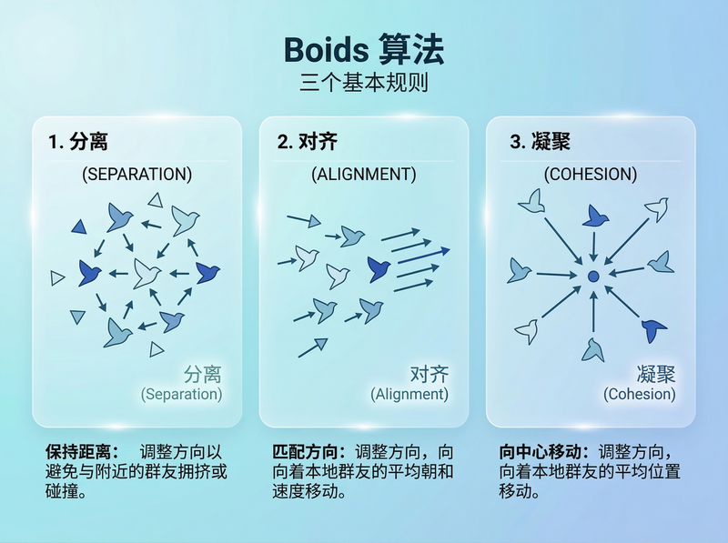
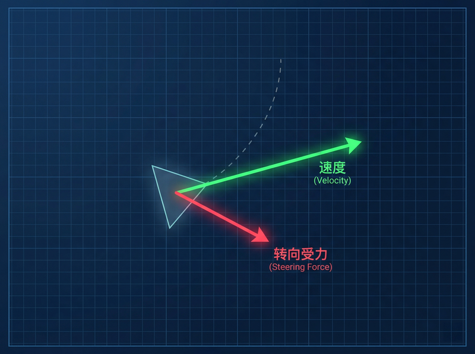
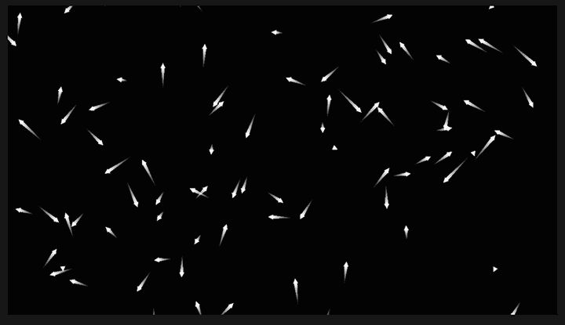
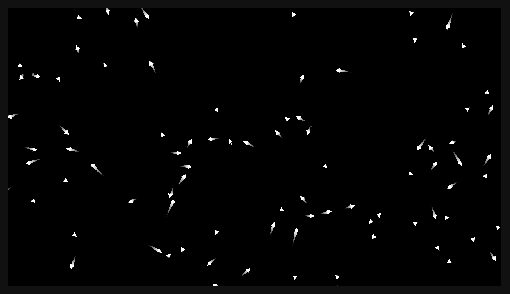
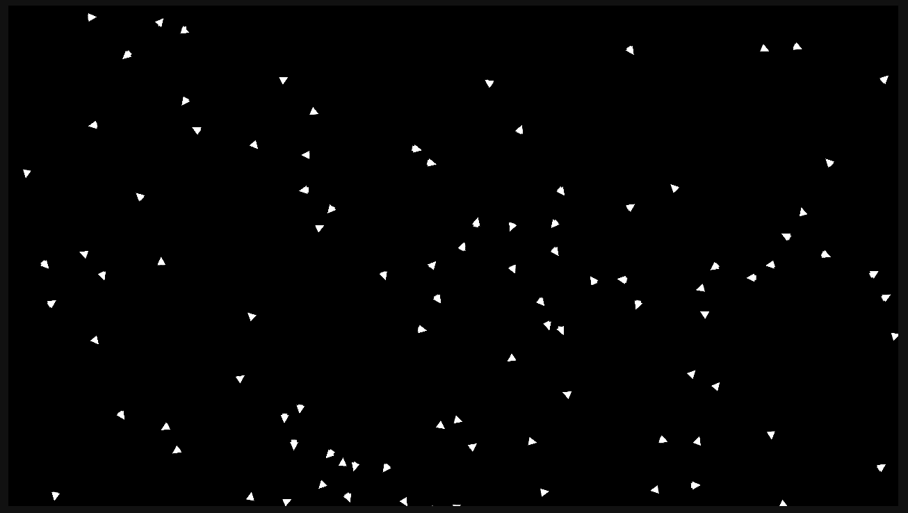
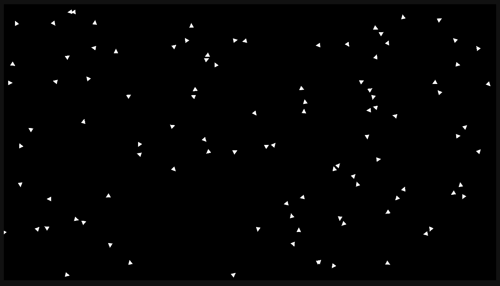
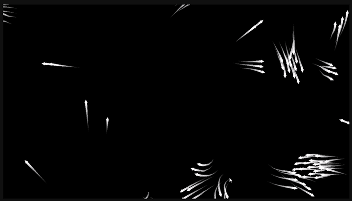

点击上方**码不了一点**+关注和**★ 星标**


# 涌现之美：用 Cocos 手搓 3A 大作同款的“群体智能”


## 引言

你是否曾在《瘟疫传说》中被如潮水般涌来的鼠海震撼？或者在《对马岛之魂》里停下脚步，仰望天空中盘旋的飞鸟？又或者在《流放者柯南》中面对成百上千的丧尸潮感到局促不安？

这些游戏中的庞大群体往往由成百上千个独立单位组成。
如果开发者给每一只动物、每一只飞鸟都费心手写移动轨迹，恐怕写到地老天荒也写不完；
要是让它们都用寻路算法（比如 A*）追踪同一个目标，它们又会笨拙地挤成一团甚至重叠在一起，毫无真实的生命感可言。

那么，怎样才能让大量的独立 NPC 表现出宛如真实生命体般的**集体智慧**，并且丝毫不觉得死板呢？

答案就是诞生于 1986 年、至今仍在广泛应用且被无数大作采用的**集群行为（Flocking）算法 —— Boids**。

1986 年，计算机图形学专家 Craig Reynolds 在仔细观察了真实的鸟群和鱼群后，发现了一个惊人的秘密：
**在庞大的群体中其实并没有一个“发号施令的总指挥”，宏观上极为复杂的群体运动，仅仅是成百上千个个体在遵循几条极简的底层规则而“涌现”出来的。**

由此他提炼出了堪称集群动画里黄金法则的三条定律：
1. **分离 (Separation)**：**社恐发作**。如果发现有同伴离得太近了，赶紧闪开。
2. **对齐 (Alignment)**：**从众心理**。看看周围的同伴往哪个方向飞，把速度和方向调整成跟大家一样。
3. **凝聚 (Cohesion)**：**抱团取暖**。落单容易被猎食吃掉，要尽量朝着视野内伙伴们的中心区域靠拢。



今天，咱们就来揭秘这个“群体智慧之源”。
有别于枯燥的算法理论课，**今天我们将在一张白纸上，带你在 Cocos Creator 里“写一行看一行”，循序渐进地手写一个惊艳的鸟群系统！**

## 涉及知识
- TypeScript
- CocosCreator 3.x
- 向量数学运算

---

## 阶段一：创造生命 —— 让游魂动起来

在数学的视界中，“速度”、“位置”和“力”都可以用**向量（Vector）**来完美表示。
我们首先来定义单只鸟 (`Boid`) 的灵魂载体，以及管理这群鸟的上帝视角 (`FlockManager`)。

### 1. 鸟类个体的底层基石 (`Boid.ts`)

为了能在一会儿测试，我们先给鸟最基本的：**位置**、**速度**、**加速度(受力)** 以及一个**更新引擎**。

```typescript
// Boid.ts
import { Vec2, v2 } from 'cc';

export class Boid {
    // ---------------- 核心物理属性 ----------------
    // 当前鸟所在的(x, y)二维坐标位置
    position: Vec2 = v2(0, 0);
    // 当前的飞行速度和方向，初始给一个(-120~120)的随机乱飞速度向量
    velocity: Vec2 = v2((Math.random() - 0.5) * 240, (Math.random() - 0.5) * 240);
    // 加速度（在每一帧中，它实际上代表本帧内该鸟受到的所有【极简法则合力】）
    acceleration: Vec2 = v2(0, 0);

    // ---------------- 极限参数限制 ----------------
    maxSpeed: number = 240; // 极限飞行速度
    maxForce: number = 9;   // 转身有多灵活（决定了飞行平滑度）

    /**
     * 辅助函数：限制向量的最大长度，确保不会无限加速
     */
    limitVector(vec: Vec2, max: number) {
        if (vec.lengthSqr() > max * max) {
            vec.normalize().multiplyScalar(max);
        }
    }

    /**
     * 每帧调用，通过加速度更新速度，通过速度更位置
     * @param dt 帧间隔时间（Delta Time）
     */
    update(dt: number) {
        // 物理公式：速度 = 初始速度 + 加速度 * 时间
        const acc = this.acceleration.clone();
        acc.multiplyScalar(dt * 60);
        this.velocity.add(acc);
        this.limitVector(this.velocity, this.maxSpeed); // 限制不要超速

        // 物理公式：位移 = 初始位移 + 速度 * 时间
        const vel = this.velocity.clone().multiplyScalar(dt);
        this.position.add(vel);

        // 重要：每计算完一帧位移，重置加速度（合力归零），准备迎接下一帧的新受力分析
        this.acceleration.set(0, 0);
    }
}
```


### 2. 初始化大军与场景 (`FlockManager.ts`)

有了鸟的数据核心，是时候在 Cocos 场景里将其具象化了。
新建一个空节点挂载这个 `FlockManager` 脚本，并把我们提前做好的“小三角形”预制体拖给它。

```typescript
// FlockManager.ts
import { _decorator, Component, Node, instantiate, Prefab, Vec3, view, UITransform, MotionStreak } from 'cc';
import { Boid } from './Boid';
const { ccclass, property } = _decorator;

@ccclass('FlockManager')
export class FlockManager extends Component {
    @property(Prefab) boidPrefab: Prefab | null = null;
    @property boidCount: number = 100; // 生成的鸟儿数量

    private boidsData: Boid[] = []; // 背后的数据载体
    private boidNodes: Node[] = []; // 场景里的真实渲染节点
    private screenWidth: number = 0;
    private screenHeight: number = 0;

    start() {
        const visibleSize = view.getVisibleSize();
        this.screenWidth = visibleSize.width;
        this.screenHeight = visibleSize.height;

        for (let i = 0; i < this.boidCount; i++) {
            if (!this.boidPrefab) break;

            const node = instantiate(this.boidPrefab);
            const boid = new Boid();

            // 扔在屏幕范围内的随机某个点
            boid.position.set(
                (Math.random() - 0.5) * this.screenWidth,
                (Math.random() - 0.5) * this.screenHeight
            );
            
            this.boidsData.push(boid);
            this.boidNodes.push(node);
            this.node.addChild(node);
        }
    }

    update(dt: number) {
        // 每帧同步数据到位移矩阵上
        for (let i = 0; i < this.boidsData.length; i++) {
            const boid = this.boidsData[i];
            boid.update(dt); // 让灵魂运动

            const node = this.boidNodes[i];
            node.setPosition(boid.position.x, boid.position.y);
            
            // 把随机生成的速度向量转成鸟头朝向（2D 欧拉角）
            const angle = Math.atan2(boid.velocity.y, boid.velocity.x);
            node.setRotationFromEuler(new Vec3(0, 0, angle * 180 / Math.PI - 90));
            
            // 越界传送检查魔法：飞出屏幕视野边缘就从另一头折返！
            this.wrapAround(boid, node);
        }
    }

    /** 吃豆人屏幕穿梭边界魔法 */
    private wrapAround(boid: Boid, node: Node) {
        const halfW = this.screenWidth / 2 + 50; // 50是防穿帮的像素缓冲
        const halfH = this.screenHeight / 2 + 50;
        let wrapped = false;

        if (boid.position.x > halfW) { boid.position.x = -halfW; wrapped = true; }
        else if (boid.position.x < -halfW) { boid.position.x = halfW; wrapped = true; }

        if (boid.position.y > halfH) { boid.position.y = -halfH; wrapped = true; }
        else if (boid.position.y < -halfH) { boid.position.y = halfH; wrapped = true; }
        
        // 引擎特性处理：如果跨屏强制传送，切断原有的拖尾组件残影
        if (wrapped) {
            const streak = node.getComponent(MotionStreak) || node.getComponentInChildren(MotionStreak);
            if (streak) {
                streak.reset();
                this.scheduleOnce(() => { if (streak && streak.isValid) streak.reset(); }, 0);
            }
        }
    }
}
```



**去 Cocos 预览里看一眼吧！** 现在，屏幕上应该满屏幕散落着四处瞎飞的三角形了，碰到边缘还会从另一边钻出来。

但这还叫什么智慧对吧？接下来，让我们逐步加入三大法则，见证实机演示的肉眼可见蜕变。

---

## 阶段二：绝招一：分离 (Separation) —— 保持社交距离

**目的**：不要跟邻居撞车！
**代码逻辑**：回到 `Boid.ts`，检查所有在“排斥视野半径”内的同伴，计算一个远离它们的反向向量。越靠近你的同伴，对你产生的排斥力就越大。

```typescript
// 追加于 Boid.ts 内部
    /** 
     * 计算分离力 (Separation)
     * @param boids 整个鸟群数组
     * @param perception 鸟的感知视野半径 
     */
    separation(boids: Boid[], perception: number): Vec2 {
        const steering = v2(0, 0); // 最终我们要返回的转向力
        let total = 0; // 记录有多少同伴进入了过于亲密的排斥区域

        for (const other of boids) {
            if (other === this) continue; // 不和自己比较

            const dist = Vec2.distance(this.position, other.position);
            // 规则1：如果距离小于 perception * 0.5（防撞安全距离设为视野一半）
            if (dist > 0 && dist < perception * 0.5) {
                // 计算从同伴指向自己的向量（远离的方向）
                const diff = this.position.clone().subtract(other.position);
                diff.multiplyScalar(1 / (dist * dist)); // 距离越近，排斥力成倍剧增！
                steering.add(diff);
                total++;
            }
        }

        if (total > 0) {
            steering.multiplyScalar(1 / total); // 求平均逃离力
            steering.normalize().multiplyScalar(this.maxSpeed); // 全速逃逸
            steering.subtract(this.velocity); // Craig Reynolds 转向公式：期望速度 - 当前速度
            this.limitVector(steering, this.maxForce); // 不让转身动作太突兀
        }
        return steering;
    }
    
    /** 算法交响乐大熔炉！用于后续堆叠不同的力使用 */
    flock(boids: Boid[], perception: number, weights: any) {
        // 第一道力：分离
        const sep = this.separation(boids, perception).multiplyScalar(weights.sep);
        this.acceleration.add(sep);
    }
```

我们要把这股力赋予群雄了！打开 `FlockManager.ts` 的 `update`：

```typescript
// 修改 FlockManager.ts 的 update(dt) 第一步：
    update(dt: number) {
        const weights = { sep: 1.5, ali: 0, coh: 0 }; // 目前我们只开启分离的强度！
        const perception = 50;

        // 【新增逻辑】赋予群落每一只鸟当前帧的群落感应分析
        for (const boid of this.boidsData) {
            boid.flock(this.boidsData, perception, weights);
        }

        // ... 原有的同步节点代码保持不变 ...
```



**再次运行游戏**！看！它们是不是一旦面临撞车危机，就会极其敏锐地抽搐弹开了？尽管此刻依然毫无整体大局观，但求生欲已初步体现！

---

## 阶段三：绝招二：对齐 (Alignment) —— 保持步调一致

**目的**：跟着身边的群体一起“随波逐流”。
**逻辑**：回到 `Boid.ts`，算出周围视野范围内同伴的“平均飞行方向和速度”，然后努力把自己的飞行速度调整到和大家一致。

```typescript
// 追加于 Boid.ts 内部
    /** 计算对齐力 (Alignment) */
    alignment(boids: Boid[], perception: number): Vec2 {
        const steering = v2(0, 0);
        let total = 0;

        for (const other of boids) {
            if (other === this) continue;

            const dist = Vec2.distance(this.position, other.position);
            // 如果同伴在自己的广角视野之内
            if (dist > 0 && dist < perception) {
                steering.add(other.velocity); // 观察同伴的飞行速度并累加
                total++;
            }
        }

        if (total > 0) {
            steering.multiplyScalar(1 / total); // 算出视野内的平均前进方向！
            steering.normalize().multiplyScalar(this.maxSpeed);
            steering.subtract(this.velocity);
            this.limitVector(steering, this.maxForce);
        }
        return steering;
    }

    // 修改 flock 大熔炉：
    flock(boids: Boid[], perception: number, weights: any) {
        const sep = this.separation(boids, perception).multiplyScalar(weights.sep);
        const ali = this.alignment(boids, perception).multiplyScalar(weights.ali); // <- 新增对齐融合
        
        this.acceleration.add(sep);
        this.acceleration.add(ali);
    }
```

去 `FlockManager.ts` 把对齐系数打开 (`const weights = { sep: 1.5, ali: 1.0, coh: 0 };`) 再次运行！



**见证成长**！你是不是开始觉得头皮发麻了？仅仅多加了一点点的随波逐流代码，它们在没有任何总指挥的情况下，屏幕上已经自然涌现出列阵巡航的**雁阵**行为！

---

## 阶段四：绝招三：凝聚 (Cohesion) —— 寻找组织的中心

**目的**：别脱队，向着大群体内部靠拢。
**逻辑**：算出周围所有同伴的中心点坐标，朝着那个组织的中心区域飞去。落单可是很危险的！

```typescript
// 追加于 Boid.ts 内部
    /** 计算凝聚力 (Cohesion) */
    cohesion(boids: Boid[], perception: number): Vec2 {
        const steering = v2(0, 0);
        let total = 0;

        for (const other of boids) {
            if (other === this) continue;

            const dist = Vec2.distance(this.position, other.position);
            if (dist > 0 && dist < perception) {
                steering.add(other.position); // 记录周围兄弟的位置
                total++;
            }
        }

        if (total > 0) {
            steering.multiplyScalar(1 / total); // 求出“群体质心”
            return this.seek(steering);         // 向着这个中心点靠近（下面是辅助方法）
        }
        return v2(0, 0);
    }

    /** 辅助力：靠近某个具体的坐标目标点 */
    seek(target: Vec2): Vec2 {
        const desired = target.clone().subtract(this.position); // 期望路线永远是指向目标
        desired.normalize().multiplyScalar(this.maxSpeed);
        const steering = desired.subtract(this.velocity);
        this.limitVector(steering, this.maxForce);
        return steering;
    }

    // 最后！终极大熔炉合体！
    flock(boids: Boid[], perception: number, weights: any) {
        const sep = this.separation(boids, perception).multiplyScalar(weights.sep);
        const ali = this.alignment(boids, perception).multiplyScalar(weights.ali);
        const coh = this.cohesion(boids, perception).multiplyScalar(weights.coh); // <- 新增向心聚合
        
        this.acceleration.add(sep);
        this.acceleration.add(ali);
        this.acceleration.add(coh);
    }
```

为了方便运行时动态微调上帝视角，在 `FlockManager.ts` 中可以用 `@property` 把这三个权重的系数暴露在编辑器面板上！

在代码中把 `coh` 也设为 `1.0` 后，**点击运行！**



无需去费劲写复杂的场景导航寻道网格生成，也没有高人一等的死算法中控调配，只要简单的三条法叠加：这 100 只小鸟就已经完全拥有了生命和意志！

---

## 阶段五：高阶戏法 —— 降下灭世黑手与引导群星 (鼠标干预)

如果光是在荧幕做看客终究还是让人感觉发痒。我们完全可以结合底层引擎的输入事件，人为地降下一股“强交互干预力”：

- **逃避捕食者 (Flee)**：充当神龛上的灾难黑手，玩家一键右击播散恐慌从而引起急退的逃离力。
- **目标吸引 (Arrive)**：充当喂鸟者的火种，玩家一键左击引诱整个群体向你的鼠标汇集。

我们只需要在 `Boid.ts` 追加一个**急剧回退**的具体物理实现：

```typescript
    /** 遇到天敌，逃离！(Flee) */
    flee(target: Vec2, radius: number): Vec2 {
        const d = Vec2.distance(this.position, target);
        // 只有进入灾变危机半径才逃命
        if (d < radius) {
            const desired = this.position.clone().subtract(target); // 强推向远处的排斥向量
            desired.normalize().multiplyScalar(this.maxSpeed * 2);  // 逃命潜能激发，2倍速撤离！
            const steering = desired.subtract(this.velocity);
            this.limitVector(steering, this.maxForce * 3);          // 逃命转身异常暴力，3倍灵敏度！
            return steering;
        }
        return v2(0, 0);
    }
```

紧接着修改主场控 `FlockManager.ts` 去拦截并在 `update` 截获鼠标：
*(核心注册监听与局部坐标系转换这里略过基础 API 篇幅，重点看是如何介入物理大锅的)*

```typescript
        // 在 FlockManager.ts 的 update 中第一步结算处追加：
        for (const boid of this.boidsData) {
            boid.flock(this.boidsData, perception, weights);

            // 神迹干预启动！
            if (this.mouseActive) {
                if (this.mouseAttract) {
                    // 左键黑洞：施加强大的引力(2倍强度拉扯)
                    const attract = boid.seek(this.mousePosInput).multiplyScalar(2);
                    boid.acceleration.add(attract);
                } else {
                    // 右键灾变：如果距离鼠标300范围，立刻疯狂往四围溃散！
                    const fleeForce = boid.flee(this.mousePosInput, 300);
                    boid.acceleration.add(fleeForce);
                }
            }
        }
```

看懂了吗？只要理解了万物皆不过是**“向量叠加”**与不同权重的比对这一开发核心底座思路，无论你接下来想塞进去多少神奇的机制，比如：“逆向风眼推力”、“固定的地形墙壁防撞排斥场”，都能水到渠成。



---

## 性能优化

心细追求硬核上限的朋友可能早就发现了一个潜在问题，当在我们在每一轮循环更新算计其中一只飞鸟的具体受力干预时，全都使用了 `for` 循环遍历**所有的其余鸟类**一次去寻找相邻点！

对于区区 100 只的系统这可能也就计算了 $100 \times 100 = 1$ 万次，在此几乎无感。若是 10000 只感染者呢？那就是惊人的 1 亿次遍历，设备肯定当即就彻底卡死掉帧了。
面对海量单位的大后期同频渲染课题，我们就急需引入**四叉树 (QuadTree)** 或基于桶切分的 **哈希网格机制 (Spatial Hash Grid)**，强行将关联计算进行局部切片化隔离。这部分硬核的高分级性能优化，咱们单独留到下一期深入实战吃透！
## 相关代码在哪里

这期项目的完整开源体验版我已经老规矩上载到了我的代码库：
> https://github.com/haiyoucuv/Wechat_article

## 结语

用极致简化的数学公式和物理法则去细腻解构出繁杂生生不息生命的活动脉络，那是多棒的旅途。那成千上万在重构之后能引发感官奇迹运行的代码，正是我们独立游戏人在充当自己数字宇宙“核心造物主”的那些刻骨铭心的硬核浪漫。

群体的钥匙已经放进你的工具箱了，赶紧打开编辑器去缔造属于你的一人军团涌现吧！


点击上方**码不了一点**+关注和**★ 星标**
