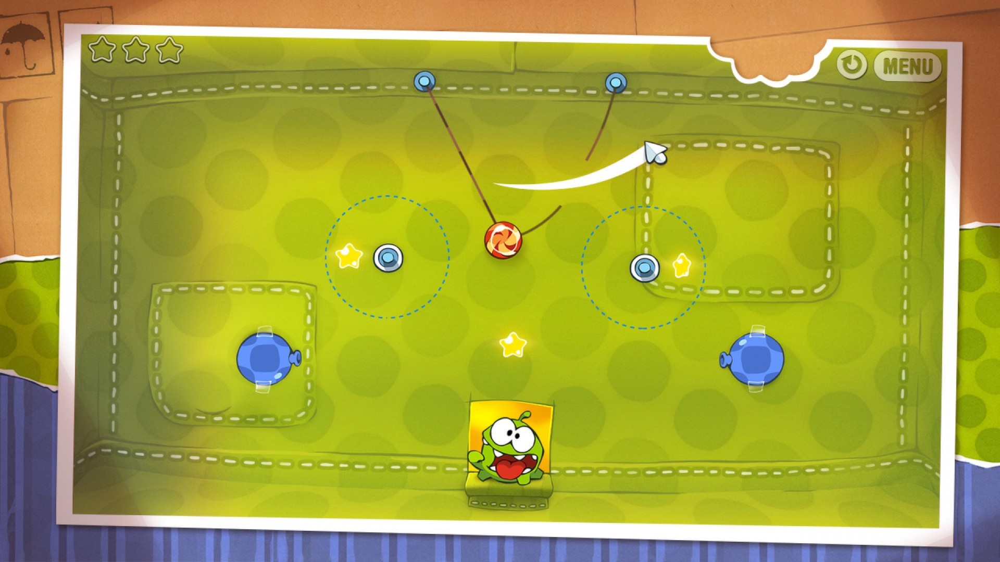
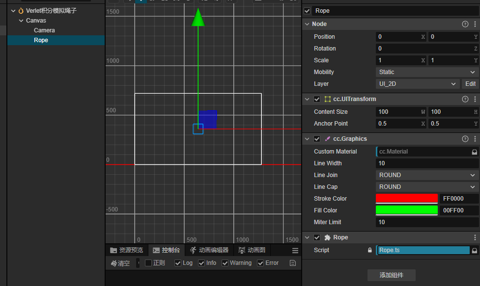
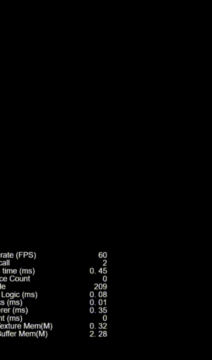

点击上方**码不了一点**+关注和**★ 星标**




## 引言
在《只狼》《塞尔达传说》等大作中，你是否见过绳桥摇曳的逼真效果？这种物理表现的核心就是绳索模拟技术。本文将揭秘通过Verlet积分实现实时绳索模拟的方案，并配合Cocos Creator进行实战演示。

## 本文以以往文章代码库
> https://github.com/haiyoucuv/Wechat_article

## 涉及知识
- TypeScript
- CocosCreator3.x
- 代数几何

## Verlet积分核心原理

相比传统欧拉法，`Verlet`积分通过位置差求速度：
> 速度 = 当前帧的位置 - 上一帧的位置
> 下一帧的位置 = 当前帧的位置 + 速度 * 步长
> 其他力的影响

这种方法的优势在于：
1. 无需显式存储速度，减少状态变量
2. 数值稳定性更好
3. 能量守恒性质更好

### 约束求解
绳索的物理特性主要通过距离约束实现：
1. 相邻节点间距保持固定
2. 通过多次迭代调整位置满足约束
3. 约束求解确保绳索不会过度拉伸

## 代码实现

创建一个场景，并创建一个Rope脚本，场景中新建节点并添加`Graphics`组件，用于绘制绳索。


我们先实现一个节点类，和一个重力常量，包含位置、上一帧位置等状态变量。

然后创建出来进行测试


### 节点类定义
```typescript
/**
 * 重力
 */
const GRAVITY = new Vec2(0, -98);

class RopeNode {

    /**
     * 当前帧位置
     */
    pos: Vec2 = null;

    /**
     * 上一帧的位置
     */
    prePos: Vec2 = null;

    constructor(x: number, y: number) {
        this.pos = v2(x, y);
        this.prePos = v2(x, y);
    }

    onUpdate(dt: number) {

        // 计算速度（这个步长已经是两帧之间的步长了）
        const v = Vec2.subtract(new Vec2(), this.pos, this.prePos);

        // 保存上一帧的位置
        this.prePos.set(this.pos);

        // 叠加重力加速度
        v.add(Vec2.multiplyScalar(new Vec2(), GRAVITY, dt));

        // 计算下一帧位置
        this.pos.add(v);
    }

}
```

在脚本中创建出来进行测试
```typescript

@ccclass('Rope')
export class Rope extends Component {
    private graphics: Graphics = null;

    point: RopeNode = null;

    onLoad() {
        this.graphics = this.node.getComponent(Graphics);
    }

    start() {
        this.point = new RopeNode(0, 300);
    }

    /**
     * 绘制
     */
    draw() {
        this.graphics.clear();
        // 画出点
        this.graphics.moveTo(this.point.pos.x, this.point.pos.y);
        this.graphics.circle(this.point.pos.x, this.point.pos.y, 30);
        this.graphics.fill();
    }

    /**
     * 更新
     * @param dt
     */
    update(dt: number) {
        this.point.onUpdate(dt);
    }
}
```

我们可以看到这个节点加速移出屏幕外了，说明我们的代码是没问题的。


## 实现绳索

接下来我们实现一个完整的绳索类，包含节点数组、基础长度、节点数量等状态变量。
实现绳索的关键是实现节点间的约束求解，确保绳索的物理特性。
我们来实现一个简单的约束demo
### 绳索类核心逻辑
```typescript
@ccclass('Rope')
export class Rope extends Component {
    /**
     * 节点数组
     */
    nodeArr: RopeNode[] = [];

    /**
     * 头节点
     */
    head: RopeNode = null;

    /**
     * 基础长度
     */
    baseLen = 20;

    /**
     * 节点数量
     */
    count = 30;

    private graphics: Graphics = null;

    onLoad() {
        this.graphics = this.node.getComponent(Graphics);
        input.on(Input.EventType.TOUCH_MOVE, this.onTouchMove, this);
    }
    
    start() {
        // 初始化节点
        for (let i = 0; i < this.count; i++) {
            this.nodeArr.push(new RopeNode(0, 0));
        }
        this.head = this.nodeArr[0];
    }

    /**
     * 鼠标事件，用于把头节点移到指定位置
     */
    onTouchMove = (() => {
        const tempPos = new Vec3();

        return (e: EventTouch) => {
            const uiPos = e.getUILocation();
            tempPos.set(uiPos.x, uiPos.y, 0);
            this.getComponent(UITransform).convertToNodeSpaceAR(tempPos, tempPos);
            //  把头部移动到指定位置
            this.head.pos.set(tempPos.x, tempPos.y);
        }
    })()

    /**
     * 更新节点
     * @param dt
     */
    updatePoints(dt: number) {
        const { nodeArr } = this;
        const len = nodeArr.length;
        for (let i = 1; i < len; i++) {
            const p = nodeArr[i];
            p.onUpdate(dt);
        }
    }

    /**
     * 简单的约束
     */
    constraint() {
        const { nodeArr } = this;

        // 多次迭代保证稳定性
        const time = 20;
        for (let step = 0; step < time; step++) {

            const len = this.nodeArr.length - 1;
            for (let i = 0; i < len; i++) {

                const p = nodeArr[i];
                const next = nodeArr[i + 1];
                
                // 相邻节点间距
                const dp = Vec2.subtract(new Vec2(), p.pos, next.pos);
                const dis = dp.length();

                // 超出基础长度时调整位置
                if (dis > this.baseLen) {
                    const delta = dis - this.baseLen;
                    const dir = dp.normalize().multiplyScalar(delta);
                    if (i !== 0) {
                        dir.multiplyScalar(0.5);
                        p.pos.subtract(dir);
                        next.pos.add(dir);
                    } else {
                        next.pos.add(dir);
                    }
                }
            }
        }
    }

    /**
     * 绘制
     */
    draw() {
        this.graphics.clear();

        //  画出绳子
        this.graphics.moveTo(this.head.pos.x, this.head.pos.y);
        for (let i = 1; i < this.nodeArr.length; i++) {
            const node = this.nodeArr[i];
            this.graphics.lineTo(node.pos.x, node.pos.y);
        }
        this.graphics.stroke();

        // 画出节点
        for (let i = 0; i < this.nodeArr.length; i++) {
            const node = this.nodeArr[i];
            this.graphics.moveTo(node.pos.x, node.pos.y);
            this.graphics.circle(node.pos.x, node.pos.y, 5);
            this.graphics.fill();
        }
    }

    /**
     * 更新
     * @param dt
     */
    update(dt: number) {
        this.updatePoints(dt);
        this.constraint();
        this.draw();
    }
}
```

我们可以看到，这个demo已经实现了一个简单的绳索，我们可以通过鼠标移动头节点，来改变绳索的长度。


## 实现要点解析

### 1. 位置更新

#### 速度计算
- 通过位置差计算速度：`v = pos - prePos`
- 无需显式存储速度状态变量
- 自动包含了上一帧的加速度影响

#### 重力影响
- 重力加速度产生的位移：`Δv = g * dt`
- 可以通过调整重力系数控制下落速度

#### 位置更新流程
1. 保存当前位置到prePos
2. 计算速度向量(pos - prePos)
3. 应用重力加速度影响
5. 更新节点新位置

### 2. 约束处理
- 检测相邻节点间距
- 超出基础长度时调整位置
- 多次迭代保证稳定性

### 3. 绘制渲染
- 使用Graphics组件绘制
- 连接节点形成绳索
- 可视化节点位置

## 应用场景
- 游戏物理：绳索、藤蔓、锁链等
- 布料模拟：旗帜、衣物等
- 特效制作：丝带、流苏等

## 相关代码在哪里

> https://github.com/haiyoucuv/Wechat_article

## 结语
Verlet积分因其简单高效的特点，在游戏物理模拟中广受欢迎。本文介绍的绳索模拟方案，可以轻松实现逼真的物理效果，希望对你的游戏开发有所帮助。

点击上方**码不了一点**+关注和**★ 星标**