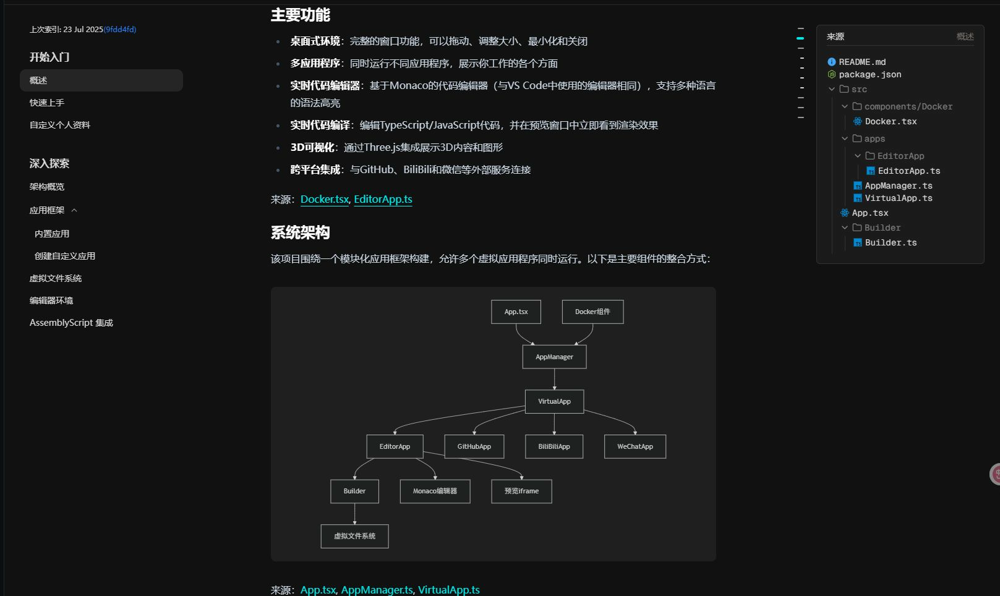
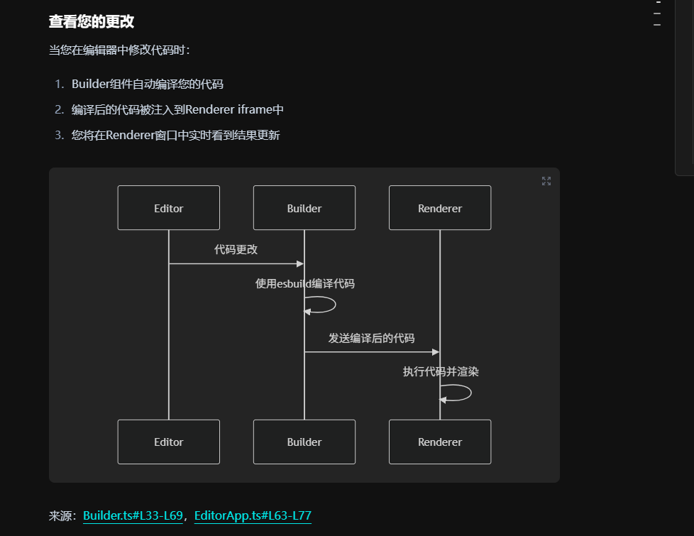
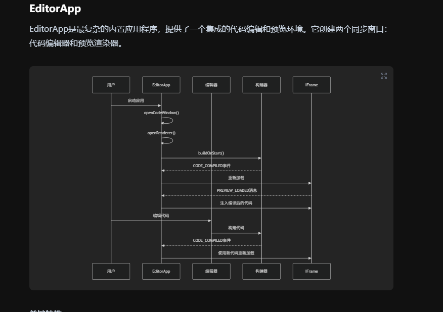

# 我的代码与zread.ai的邂逅

作为一名开发者，我之前完成了一个个人介绍网站项目。

坦白讲，在整个开发过程中，我经历了无数次"删了改，改了删"的循环，
一直专注于功能实现而忽略了整体架构。

我常常认为自己的代码写得比较一般，甚至有些杂乱无章。
直到我遇到了zread.ai，一切都发生了改变。

## 代码迷宫中的自我怀疑
我的个人介绍网站项目

[haiyoucuv/profile](https://github.com/haiyoucuv/profile)

[ProfileWeb](https://haiyoucuv.games/)

是一个基于React和TypeScript的应用，设计初衷是创建一个独特的个人展示平台。

在开发过程中，我实现了许多有趣的功能：

1. 模拟操作系统的应用管理系统
2. 浏览器内的虚拟文件系统
3. 集成Monaco编辑器的代码编辑环境
4. 多种内置应用（GitHub、BiliBili、WeChat等）
5. AssemblyScript集成以提升性能

然而，随着功能不断增加，代码库变得越来越庞大。
目录结构虽然看似有序，但我始终觉得整体架构缺乏清晰的设计理念。
每当我回顾代码时，总会产生"这段代码真的写得好吗？"的疑问。

## zread.ai：意外的代码解析者
就在我依然对自己的代码质量感到迷茫之际，我尝试使用了zread.ai。
这是一个能够理解和分析代码库的AI工具。

我原本只是抱着试一试的心态，没想到它给我带来了惊喜。

这是zread.ai为我的项目生成的分析文档：

https://zread.ai/haiyoucuv/profile/3-customizing-your-profile

zread.ai为我的项目创建了一份清晰的功能架构图，展示了各组件之间的关系和数据流向。

它准确识别出了我实现的核心架构：
1. AppManager - 管理多个虚拟应用的单例系统
2. VirtualFS - 完整的文件系统模拟实现
3. Builder - 浏览器内的代码构建系统
4. 编辑器集成 - 专业的代码编辑环境

更令人惊讶的是，zread.ai不仅理解了代码的结构，还捕捉到了我在设计上的独特思路，如模拟操作系统的应用管理方式和虚拟文件系统的实现。

## 重新审视自己的代码
当我通过zread.ai的视角重新审视自己的代码时，我意识到我的项目其实有着相当不错的架构设计：

这些代码虽然不完美，但展现了相当的工程思维和技术深度。
我逐渐认识到，自己对代码的过度自我批评，可能掩盖了它真正的价值。

## zread.ai的魔力：代码理解与架构可视化

zread.ai之所以能够给我带来如此大的启发，在于它不仅仅是一个代码分析工具，
更是一个能够理解代码意图的AI伙伴。它具备以下能力：

1. 代码结构梳理 - 清晰展示项目的目录结构和文件关系
2. 架构可视化 - 将抽象的代码关系转化为直观的架构图
3. 设计模式识别 - 识别出代码中使用的设计模式和架构思想
4. 核心功能提取 - 提炼出项目的核心功能点和技术特色

对于像我这样时常陷入自我怀疑的开发者，zread.ai提供了一个客观的外部视角，帮助我重新评估自己的工作。

## 重获自信：代码也不是那么差

通过zread.ai的分析，我发现自己的代码实际上实现了一个相当复杂和创新的系统：

1. 模块化设计 - 各功能模块职责清晰，耦合度低
2. 扩展性考虑 - 虚拟应用框架设计允许轻松添加新应用
3. 技术整合 - 成功整合了多种现代Web技术
4. 用户体验 - 创造了独特的交互方式和视觉体验

这让我重新获得了对自己技术能力的信心。

有时候，我们需要借助外部工具来打破自我认知的局限，看到我们工作的真正价值。

## 启示与未来计划

### 这次与zread.ai的偶遇给了我重要的启示：

1. 客观评价很重要 - 开发者往往过于苛责自己的代码
2. 工具可以带来新视角 - 利用先进工具重新审视自己的工作
3. 架构可视化的价值 - 清晰的架构图有助于理解和改进系统设计

### 基于这些认识，我计划：

1. 完善个人网站的内容填充
2. 优化已有架构，进一步提升代码质量
3. 在未来项目中，更加注重前期架构设计
4. 定期使用工具如zread.ai来客观评估项目状态

## 结语

从"我的代码比较一般"到"也不是那么差劲"，这个认知的转变让我对自己的工作有了全新的理解和珍视。

有时候，我们需要一面"魔镜"来帮我们看清自己的作品。

对我而言，zread.ai就是那面魔镜，它让我看到了自己代码中被忽视的亮点和价值。

作为开发者，我们应该学会欣赏自己的工作，同时借助先进工具来不断改进。

毕竟，代码不仅是功能的实现，更是思想的表达和创意的实践。
